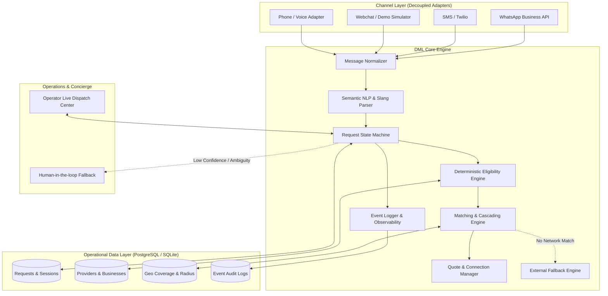
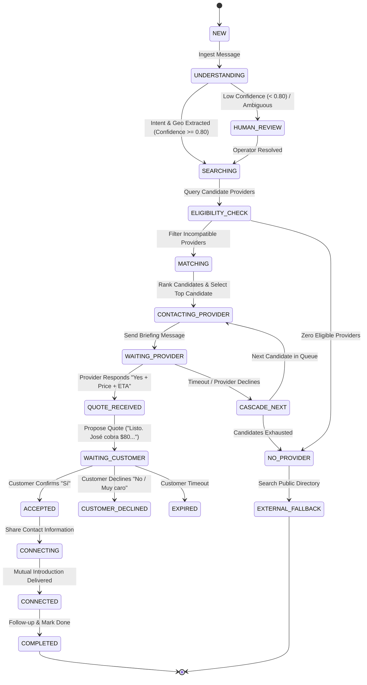

# DAME LA LETRA (DML) — Master Product Architecture & Implementation Plan

> **Product Creed**: *"DML debe eliminar pasos, no agregarlos. El cliente no debe tener que aprender DML; DML debe aprender a entender al cliente. La tecnología debe ser invisible: 'Necesito esto' → 'Dame un momento' → 'Listo'."*

---

## A. Current State Audit

1. **Workspace Inspection**:
   - Checked `C:\Users\migue\.gemini\antigravity-ide\scratch` and user root directory.
   - Found only `toonhub-hero` (an unrelated canvas animation project).
   - **Result**: No existing codebase or legacy dependencies for Dame La Letra currently exist. This is a clean greenfield project.
2. **Environment & Runtime Audit**:
   - **Node.js**: `v24.19.0` (active)
   - **npm**: `11.17.0` (active)
   - **Python**: `3.12.10` (active)
   - **Git**: `2.55.0` (active)
   - **Docker / PostgreSQL**: Docker daemon and local `psql` are not running locally.
   - **Architectural implication**: For local development, fast testing, and immediate execution, an embedded SQLite database with clean repository abstractions (designed for direct 1-to-1 migration to PostgreSQL + PostGIS + pgvector) ensures zero setup friction while honoring strict relational and geospatial requirements.

---

## B. What Already Exists

- The complete vision, philosophy, cultural semantics, and operational rules articulated in the Master Product Prompt.
- Installed modern JavaScript/TypeScript runtimes (`Node.js v24`, `npm 11`).
- Target operational market selected: **Louisville, Kentucky**.

---

## C. What Can Be Reused

- Clean TypeScript modular monolith patterns with domain-driven boundaries.
- Native Node.js `crypto` for HMAC webhook verification, session tokens, and security.
- Standard geospatial formulas (Haversine distance calculations in TypeScript) matching PostGIS `ST_DWithin` semantics for initial local deployment.
- High-performance web UI architecture (Vite + React + Tailwind/Vanilla CSS tokens) providing both the **Zero-Friction Customer Experience** and the **Operator Live Dispatch Center**.

---

## D. What Is Missing (To Build in MVP)

1. **Channel Ingestion & Normalization Layer**: Unified message abstraction decoupling WhatsApp, SMS, Phone, and Webchat from core logic.
2. **Semantic Understanding Layer**: Multi-dialect NLP engine supporting Cuban/Caribbean slang, Spanglish, typos, and Louisville geographical references ("Dixie Hwy", "Preston Hwy", "Bardstown Rd", "Hurstbourne").
3. **Deterministic Request State Machine**: 13-stage lifecycle (`NEW` → `UNDERSTANDING` → `SEARCHING` → `ELIGIBILITY_CHECK` → `MATCHING` → `CONTACTING_PROVIDER` → `WAITING_PROVIDER` → `QUOTE_RECEIVED` → `WAITING_CUSTOMER` → `ACCEPTED` → `CONNECTING` → `CONNECTED` → `COMPLETED`) plus exception handling.
4. **Progressive Provider Entity Model**: Profiles that learn over time with the golden rule: `UNKNOWN != NO`.
5. **Eligibility Engine**: Deterministic filtering (Service affinity, Residential vs Commercial, Geofencing, Verified License status, Capacity).
6. **Matching & Cascading Dispatch Engine**: Sequential one-at-a-time provider contact (protecting provider relationships from broadcast spam) with strict Paid Priority constraints (*money cannot override eligibility*).
7. **External Discovery Fallback**: Clear, transparent fallback when no network provider is available, explicitly disclaiming affiliation.
8. **Admin / Concierge Live Operations Dashboard**: Real-time visibility into requests, active cascades, timeouts, manual operator overrides, and Louisville demand intelligence.
9. **Interactive Customer Web Portal & Provider Simulator**: Allowing full live simulation of customer chats and provider WhatsApp/SMS exchanges.

---

## E. Recommended Architecture



### Architectural Principles
- **Separation of Concerns**: AI/NLP translates human language into structured domain intents; business logic makes deterministic decisions.
- **Provider Protection (Anti-Spam)**: Never blast 20 providers at once. Always use a cascading priority queue with timeout windows.
- **Fairness Guarantee**: Subscriptions buy priority *among eligible providers only*. Money can never qualify an incompatible provider.

---

## F. Database Schema

```sql
-- 1. Businesses
CREATE TABLE businesses (
    id TEXT PRIMARY KEY,
    name TEXT NOT NULL,
    legal_name TEXT,
    contact_phone TEXT,
    contact_email TEXT,
    tax_id TEXT,
    verified_status TEXT NOT NULL DEFAULT 'UNVERIFIED', -- VERIFIED, UNVERIFIED, EXPIRED
    city TEXT NOT NULL DEFAULT 'Louisville',
    state TEXT NOT NULL DEFAULT 'KY',
    created_at DATETIME NOT NULL DEFAULT CURRENT_TIMESTAMP,
    updated_at DATETIME NOT NULL DEFAULT CURRENT_TIMESTAMP
);

-- 2. Providers (Technicians / Independent Operators)
CREATE TABLE providers (
    id TEXT PRIMARY KEY,
    business_id TEXT REFERENCES businesses(id),
    name TEXT NOT NULL,
    display_name TEXT NOT NULL,
    phone TEXT NOT NULL UNIQUE,
    preferred_channel TEXT NOT NULL DEFAULT 'WHATSAPP', -- WHATSAPP, SMS, PHONE
    languages TEXT NOT NULL DEFAULT '["es"]', -- JSON array: ["es", "en"]
    residential_capable INTEGER NOT NULL DEFAULT 1, -- 1 = Yes, 0 = No, -1 = Unknown
    commercial_capable INTEGER NOT NULL DEFAULT -1, -- 1 = Yes, 0 = No, -1 = Unknown
    license_status TEXT NOT NULL DEFAULT 'UNKNOWN', -- VERIFIED, UNVERIFIED, UNKNOWN, EXPIRED
    license_details TEXT,
    base_latitude REAL NOT NULL,
    base_longitude REAL NOT NULL,
    max_radius_miles REAL NOT NULL DEFAULT 20.0,
    availability_status TEXT NOT NULL DEFAULT 'AVAILABLE', -- AVAILABLE, BUSY, OFF_DUTY, PAUSED
    capacity_today INTEGER NOT NULL DEFAULT 5,
    capacity_used_today INTEGER NOT NULL DEFAULT 0,
    conditional_rules TEXT, -- JSON rules: e.g. {"unavailable_after": "14:00", "min_job_size": 100}
    reliability_score REAL NOT NULL DEFAULT 1.0,
    avg_response_time_sec INTEGER NOT NULL DEFAULT 120,
    completed_connections INTEGER NOT NULL DEFAULT 0,
    cancelled_connections INTEGER NOT NULL DEFAULT 0,
    subscription_tier TEXT NOT NULL DEFAULT 'FOUNDING', -- FREE, FOUNDING, PREMIUM
    priority_score REAL NOT NULL DEFAULT 0.0,
    created_at DATETIME NOT NULL DEFAULT CURRENT_TIMESTAMP,
    updated_at DATETIME NOT NULL DEFAULT CURRENT_TIMESTAMP
);

-- 3. Provider Services & Specialties
CREATE TABLE provider_services (
    id TEXT PRIMARY KEY,
    provider_id TEXT NOT NULL REFERENCES providers(id) ON DELETE CASCADE,
    category TEXT NOT NULL, -- HVAC, PLUMBING, AUTOMOTIVE, ELECTRICAL, LANDSCAPING, etc.
    service_type TEXT NOT NULL, -- AC_REPAIR, TIRE_CHANGE, PIPE_LEAK, etc.
    specialties TEXT, -- JSON array of tags: ["drywall", "commercial_refrigeration"]
    base_callout_fee REAL,
    hourly_rate REAL,
    is_active INTEGER NOT NULL DEFAULT 1,
    created_at DATETIME NOT NULL DEFAULT CURRENT_TIMESTAMP
);

-- 4. Requests (Core Customer Unit)
CREATE TABLE requests (
    id TEXT PRIMARY KEY,
    channel TEXT NOT NULL, -- WHATSAPP, SMS, PHONE, WEB
    conversation_reference TEXT NOT NULL, -- Chat ID / Phone number
    language TEXT NOT NULL DEFAULT 'es',
    raw_message TEXT NOT NULL,
    normalized_intent TEXT,
    service_category TEXT,
    service_type TEXT,
    description TEXT,
    location_raw TEXT,
    latitude REAL,
    longitude REAL,
    property_type TEXT NOT NULL DEFAULT 'UNKNOWN', -- RESIDENTIAL, COMMERCIAL, UNKNOWN
    urgency TEXT NOT NULL DEFAULT 'MEDIUM', -- LOW, MEDIUM, HIGH, EMERGENCY
    preferred_time TEXT,
    customer_constraints TEXT, -- JSON
    status TEXT NOT NULL DEFAULT 'NEW',
    matched_provider_id TEXT REFERENCES providers(id),
    candidate_provider_ids TEXT, -- JSON array of ranked eligible provider IDs
    contacted_provider_ids TEXT, -- JSON array of already contacted IDs
    cascade_step INTEGER NOT NULL DEFAULT 0,
    cascade_expires_at DATETIME,
    quoted_price REAL,
    estimated_arrival TEXT,
    customer_confirmation INTEGER DEFAULT 0,
    connection_status TEXT NOT NULL DEFAULT 'NOT_STARTED', -- NOT_STARTED, CONNECTING, CONNECTED, FAILED
    created_at DATETIME NOT NULL DEFAULT CURRENT_TIMESTAMP,
    updated_at DATETIME NOT NULL DEFAULT CURRENT_TIMESTAMP,
    completed_at DATETIME
);

-- 5. Quotes
CREATE TABLE quotes (
    id TEXT PRIMARY KEY,
    request_id TEXT NOT NULL REFERENCES requests(id),
    provider_id TEXT NOT NULL REFERENCES providers(id),
    quoted_price REAL NOT NULL,
    estimated_arrival TEXT NOT NULL,
    notes TEXT,
    status TEXT NOT NULL DEFAULT 'PENDING', -- PENDING, ACCEPTED, DECLINED, EXPIRED
    created_at DATETIME NOT NULL DEFAULT CURRENT_TIMESTAMP,
    expires_at DATETIME
);

-- 6. External Fallback Discoveries
CREATE TABLE external_discoveries (
    id TEXT PRIMARY KEY,
    request_id TEXT NOT NULL REFERENCES requests(id),
    business_name TEXT NOT NULL,
    phone TEXT,
    address TEXT,
    service_indicated TEXT,
    source TEXT NOT NULL DEFAULT 'PUBLIC_DIRECTORY',
    distance_miles REAL,
    disclaimer_sent INTEGER NOT NULL DEFAULT 1,
    created_at DATETIME NOT NULL DEFAULT CURRENT_TIMESTAMP
);

-- 7. Event & Observability Logs
CREATE TABLE event_logs (
    id TEXT PRIMARY KEY,
    request_id TEXT REFERENCES requests(id),
    event_type TEXT NOT NULL, -- REQUEST_CREATED, INTENT_DETECTED, PROVIDER_CONTACTED, etc.
    actor TEXT NOT NULL, -- CUSTOMER, PROVIDER, SYSTEM, OPERATOR
    payload TEXT, -- JSON
    created_at DATETIME NOT NULL DEFAULT CURRENT_TIMESTAMP
);
```

---

## G. Request State Machine



---

## H. Progressive Provider Model (`UNKNOWN != NO`)

- **Principle**: Providers are not subjected to tedious 50-field onboarding forms. They join with name, phone, base category, and city.
- **Tristate Fields**:
  - `residential_capable`: `1` (Yes), `0` (No), `-1` (Unknown).
  - `commercial_capable`: `1` (Yes), `0` (No), `-1` (Unknown).
  - `license_status`: `VERIFIED`, `UNVERIFIED`, `UNKNOWN`, `EXPIRED`.
- **Dynamic Learning Workflow**:
  - When a commercial request arrives and José's `commercial_capable` is `UNKNOWN (-1)`:
  - System asks José: *"José, tenemos un trabajo de divisiones en una oficina. ¿Haces comercial?"*
  - José: *"Sí, dale."* → System updates `commercial_capable = 1`.
  - Next time, José is immediately eligible for commercial jobs without asking again.
- **Natural Language Rules Engine**:
  - *"Hoy descanso a las 12"* → `conditional_rules.unavailable_after = "12:00"`.
  - *"No me mandes nada a más de 10 millas"* → `max_radius_miles = 10.0`.
  - *"Hoy solo hago 2 trabajos"* → `capacity_today = 2`.

---

## I. Deterministic Eligibility Engine

A candidate provider must pass **all** hard deterministic gates to be deemed eligible:

| Gate | Validation Rule | Exclusion Reason |
|---|---|---|
| **1. Service Affinity** | Provider active in requested `service_category` or matching keyword | `CATEGORY_MISMATCH` |
| **2. Property Scope** | If `property_type == COMMERCIAL`, provider `commercial_capable != 0` (allowed if `1` or `UNKNOWN`) | `RESIDENTIAL_ONLY` |
| **3. Geographic Radius** | `HaversineDistance(request.lat, request.lng, provider.lat, provider.lng) <= provider.max_radius_miles` | `OUT_OF_SERVICE_RADIUS` |
| **4. Capacity** | `capacity_used_today < capacity_today` and `availability_status == 'AVAILABLE'` | `CAPACITY_EXHAUSTED` |
| **5. License Requirement** | If request requires state licensed contractor (e.g. Master Electrician / State HVAC), provider cannot have `EXPIRED` license | `UNVERIFIED_OR_EXPIRED_LICENSE` |

---

## J. Matching Engine & Cascading Strategy

### 1. Scoring Function (Among Eligible Providers Only)
$$\text{Score} = (0.35 \times \text{ProximityScore}) + (0.25 \times \text{ReliabilityScore}) + (0.20 \times \text{ResponseSpeedScore}) + (0.10 \times \text{ServiceAffinity}) + (0.10 \times \text{PaidPriority})$$

### 2. The Absolute Paid Priority Rule
- **Payment cannot override eligibility**: A non-commercial provider who pays $500/mo **never** scores above an eligible non-paying provider.
- Priority score strictly acts as a tie-breaker or rank boost *within the already qualified candidate pool*.

### 3. Cascading Dispatch Protocol
1. Select candidate with highest score (`Candidate 1`).
2. Dispatch discrete briefing message:
   *"Tenemos un cliente que necesita plomería en Dixie Hwy (fuga de agua). ¿Puedes atenderlo? ¿Cuánto cobras y en qué tiempo llegas?"*
3. Set timeout window (e.g., 3 minutes for urgent/emergency, 8 minutes for standard).
4. If `Candidate 1` responds with Quote (`price`, `eta`) → Move to `QUOTE_RECEIVED`.
5. If `Candidate 1` declines or times out → Log `PROVIDER_SKIPPED`, advance cascade to `Candidate 2`.
6. Repeat until matched or queue exhausted.

---

## K. Semantic Layer & Regional Dialect Dictionary

Translates colloquial natural language into structured operational intents without asking the user to choose categories:

| User Phrasing (Colloquial / Slang) | Detected Intent | Category | Subtype | Urgency |
|---|---|---|---|---|
| *"Se me ponchó la goma en Dixie"* | `TIRE_ASSISTANCE` | `AUTOMOTIVE` | `TIRE_CHANGE` | `HIGH` |
| *"El aire no tira frío"* / *"Se jodió el AC"* | `AC_REPAIR` | `HVAC` | `REPAIR` | `HIGH` |
| *"Tengo tremenda tupición en el baño"* | `CLOGGED_DRAIN` | `PLUMBING` | `DRAIN_CLEARING` | `MEDIUM` |
| *"Hay tremenda fuga de agua botándose"* | `PIPE_BURST` | `PLUMBING` | `LEAK_EMERGENCY` | `EMERGENCY` |
| *"Necesito chapear el patio y cortar la yerba"*| `LAWN_MOWING` | `LANDSCAPING`| `MOWING` | `LOW` |
| *"Se cayó una rama grande arriba del techo"* | `TREE_REMOVAL` | `TREE_SERVICE`| `EMERGENCY_REMOVAL`| `HIGH` |
| *"Se me fue la luz en media casa"* | `ELECTRICAL_FAULT`| `ELECTRICAL` | `CIRCUIT_REPAIR` | `HIGH` |

- **Confidence Threshold**:
  - `Confidence >= 0.80`: Process immediately ("Dame un momento").
  - `Confidence < 0.80`: Clarify gracefully: *"Quiero asegurarme de entenderte bien. ¿Te refieres a una fuga de agua o a destupir el desagüe?"* or route to operator console.

---

## L. Channel Abstraction Layer

A lightweight adapter interface isolating core business logic:

```typescript
export interface ChannelMessage {
  channelId: 'WHATSAPP' | 'SMS' | 'WEB' | 'PHONE';
  conversationRef: string; // Phone number or session ID
  senderId: string;
  senderName?: string;
  text: string;
  mediaUrls?: string[];
  timestamp: Date;
}

export interface ChannelAdapter {
  id: string;
  sendMessage(to: string, message: string, metadata?: Record<string, any>): Promise<boolean>;
  sendTemplate?(to: string, templateName: string, params: Record<string, string>): Promise<boolean>;
}
```

---

## M. Provider Communication Flow

```
[DML -> Provider (WhatsApp/SMS)]
"Hola José. Tenemos un cliente en Dixie Hwy que necesita reparar una fuga en el fregadero.
¿Puedes atenderlo hoy? ¿Cuánto cobras aproximadamente y en qué tiempo llegarías?"

[Provider -> DML]
"Sí, puedo llegar en 35 minutos. Cobro $85 por la revisión y reparación básica."

[DML Internal Parsing Engine]
-> intent: ACCEPT_JOB
-> quoted_price: 85.00
-> estimated_arrival: "35 minutos"
-> status: QUOTE_RECEIVED
```

---

## N. Customer Flow

```
[Customer -> DML]
"Necesito un plomero urgente, se me está botando el agua."

[DML -> Customer]
"Claro. Dame un momento."

... [DML executes eligibility, matches José, contacts José, receives quote] ...

[DML -> Customer]
"Listo. José puede atenderte. Está a unos 35 minutos y cobra $85 por la revisión. ¿Quieres que te lo conecte?"

[Customer -> DML]
"Sí, dale."

[DML -> Customer]
"Perfecto. Te conecto con José ahora: +1 (502) 555-0192. José ya tiene tus datos y va en camino."
```

---

## O. Admin Concierge Flow

- Dedicated operator command center at `/admin`:
  - **Live Kanban / Table of Requests**: Filtered by active states (`WAITING_PROVIDER`, `WAITING_CUSTOMER`, `HUMAN_REVIEW`).
  - **Live Cascades**: Displays active candidate, elapsed countdown timer, and next in line.
  - **One-Click Actions**:
    - "Manual Connect": Force-match with any verified provider.
    - "Direct Call": Trigger telephony link.
    - "Fallback": Push to external directory lookup.
  - **Louisville Demand Heatmap & Stats**: Top requested zip codes and unfulfilled categories.

---

## P. External Fallback Flow

- When zero eligible providers exist in the network:
  1. System queries cached public commercial directory for Louisville (e.g., commercial ice machines, crane services).
  2. If found, outputs transparent disclaimer message:
     *"No tenemos un proveedor verificado en nuestra red para esta especialidad en este momento, pero encontramos este negocio local en Louisville que ofrece el servicio: **Louisville Commercial Refrigeration (+1 502-555-0144)**. No forman parte de nuestra red directa, por lo que te recomendamos consultar directamente su disponibilidad."*
  3. Logs unfulfilled demand gap for future provider recruitment!

---

## Q. Privacy Model

- **No persistent consumer profiling**: No tracking cookies, no cross-site behavioral graphs, no consumer scoring.
- Requests are tied strictly to an operational `conversation_reference` (phone number or session token).
- Data retention: PII in requests auto-anonymized after 30 days; only aggregated demand metrics (*"14 plumbing requests in South Louisville on Tuesdays"*) are permanently retained.

---

## R. Security Model

- **Webhook Signature Validation**: HMAC-SHA256 verification on incoming provider/customer webhooks.
- **Operator Authentication**: Secure token-based session for `/admin` routes.
- **Input Sanitization**: Rejection of prompt injection attempts in natural language inputs.
- **Rate Limiting**: In-memory token-bucket limiter per IP/phone number to prevent abuse.

---

## S. MVP Implementation Plan

### Step 1: Project Scaffolding
- Create standalone application directory: `C:\Users\migue\.gemini\antigravity-ide\scratch\dame-la-letra`.
- Initialize Node.js TypeScript project (`package.json`, `tsconfig.json`).
- Configure backend (Express + better-sqlite3 / sqlite engine) and frontend (Vite + React + Tailwind/modern CSS tokens).

### Step 2: Core Domain & Database
- Implement database migrations and schema in `src/server/db.ts`.
- Seed realistic initial **Louisville, KY** provider network (Plumbing, HVAC, Roadside/Tires, Tree Service, Handyman, Commercial Refrigeration).

### Step 3: Semantic Engine & Dialect Matcher
- Implement `src/server/semantic.ts` with Spanish/Cuban slang lookup, Spanglish phrases, category heuristics, and Louisville location extraction.

### Step 4: State Machine & Cascading Engine
- Implement `src/server/stateMachine.ts` and `src/server/cascading.ts`.
- Include timer management for provider auto-expiry and cascading to next candidate.

### Step 5: Webhook & Channel Adapters
- Implement `ChannelAdapter` with `WebChannelAdapter` (for live UI testing) and mock `WhatsAppChannelAdapter`.

### Step 6: User Interfaces
- **Customer UI (`/`)**: Ultra-clean, human, warm landing: "¿Qué necesitas? -> Dime qué necesitas -> Dame un momento -> Listo". No login, no search forms, no filters.
- **Admin Concierge (`/admin`)**: Real-time operations center with live request feed, cascade inspector, demand intelligence, and provider manager.
- **Provider Simulator (`/provider-sim`)**: Interactive phone simulator representing the provider's phone receiving DML requests and replying in natural language.

---

## T. Phase 2 (Expansion)
- Official WhatsApp Cloud API & Twilio 10DLC registration.
- PostgreSQL + PostGIS + pgvector Docker deployment.
- Multi-technician Business Entity accounts.
- Automated Stripe billing for $25/mo founding provider subscriptions (with 3-month free trial).

---

## U. Phase 3 (Scale & Intelligence)
- Expansion to Lexington, KY, Indianapolis, IN, and Miami, FL.
- Voice channel adapter with real-time audio transcription (Whisper/Gemini Flash audio).
- B2B Demand Intelligence export for municipal and chamber of commerce partnerships.

---

## V. Test Plan

### Automated Test Matrix
1. **Semantic Parsing Test**: Validate phrases like *"Se me ponchó la goma en Dixie"* → Category: `AUTOMOTIVE`, Type: `TIRE_CHANGE`, Urgency: `HIGH`.
2. **Eligibility Test**: Verify that a request with `property_type = COMMERCIAL` strictly excludes residential-only providers.
3. **Paid Priority Test**: Verify that if Provider A ($100/mo) is residential-only, and Provider B ($0/mo) is commercial, Provider B wins a commercial request 100% of the time.
4. **Cascading Timeout Test**: Simulate Candidate 1 failing to respond within timeout window; verify Candidate 2 is automatically notified.
5. **Progressive Profile Test**: Confirm that an `UNKNOWN` capability changes to `1` when provider replies "Sí" and is preserved for subsequent queries.

### Manual Verification Flow
- Send request from Customer UI: *"El aire de la casa no enfría nada y hace tremendo calor."*
- Verify response: *"Claro. Dame un momento."*
- Open Provider Simulator: Verify notification arrives with details.
- Reply from Provider: *"Puedo ir en 30 minutos, cobro $90."*
- Check Customer UI: Observe instant update: *"Listo. Carlos puede atenderte..."*
- Confirm: Click *"Sí"* → Connection complete!

---

## W. Edge Cases Handled

1. **Vague / Incomplete Request**: Customer says *"Hola"* or *"Ayuda"*.
   - *Behavior*: DML responds warmly: *"Hola, dime qué necesitas resolver y te busco a la persona indicada."*
2. **All Providers Decline or Time Out**:
   - *Behavior*: DML checks External Fallback. If found, provides public lead; otherwise: *"Por el momento todos nuestros proveedores verificados para este servicio están ocupados. Estamos buscando opciones y te avisamos en cuanto uno se libere."*
3. **Provider Offers Excessive Price**:
   - *Behavior*: Quoted price is stored and relayed transparently to customer without markup.
4. **Customer Cancels**:
   - *Behavior*: State changes to `CANCELLED`, contacted provider is notified: *"El cliente canceló la solicitud. Gracias."*

---

## X. Observability Plan

- **North Star Metric**: **Time to Connection (TTC)** (Target: `< 5 minutes` for urgent, `< 15 minutes` for scheduled).
- **Core KPIs Tracked**:
  - Daily Request Volume
  - Eligible Match Rate (% of requests with >= 1 eligible provider)
  - Provider Response Rate & Avg Response Time
  - Cascade Drop-off Rate
  - Quote Acceptance Rate
  - Louisville Geographical Demand Distribution (by zip code / avenue)
- All events recorded with millisecond timestamps in `event_logs`.
